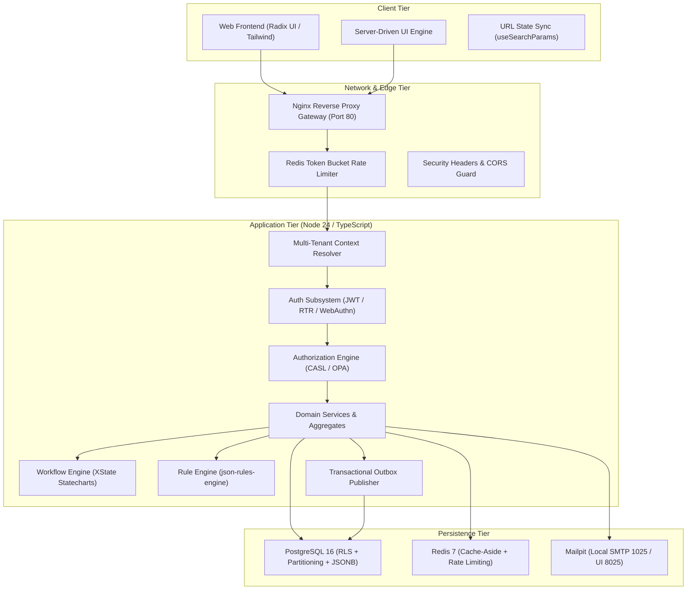
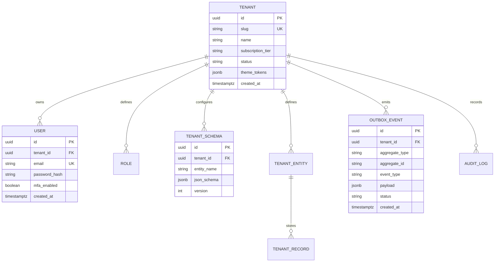

# System Knowledge Graph & Architectural Topology

> **Core Purpose:** High-density, token-efficient knowledge representation of the workspace architecture, data topologies, and subsystem boundaries, eliminating repetitive discovery prompts.

---

## 1. Architectural Subsystems Knowledge Graph

---

## 2. Multi-Tenant Data Isolation & Schema Graph

---

## 3. Subsystem Fast Lookup Index

| Capability | Primary Technology | Configuration Location | Governing Rule |
|---|---|---|---|
| **Runtime** | Node.js 24 / npm 11 | `package.json`, `.nvmrc` | [`typescript.md`](../rules/typescript.md) |
| **ORM / Database** | Prisma / PostgreSQL 16 | `prisma/schema.prisma` | [`database_transactions.md`](../rules/database_transactions.md) |
| **Tenant Isolation** | PostgreSQL Row-Level Security | Prisma Extension | [`multitenancy_isolation.md`](../rules/multitenancy_isolation.md) |
| **Dynamic Schemas** | JSONB + ajv validation | Dynamic Schema tables | [`tenant_dynamic_schemas.md`](../rules/tenant_dynamic_schemas.md) |
| **Authentication** | Access Token + Cookie RTR | In-memory + HttpOnly | [`authentication.md`](../rules/authentication.md) |
| **Authorization** | CASL / OPA Rego | Server Route Guards | [`authorization.md`](../rules/authorization.md) |
| **Caching** | Redis Cache-Aside | Redis Client wrapper | [`caching.md`](../rules/caching.md) |
| **Feature Flags** | OpenFeature + Flipt | Provider configuration | [`feature_flags.md`](../rules/feature_flags.md) |
| **Testing** | Vitest / Playwright / Supertest | `vitest.config.ts` | [`test_driven_development.md`](../rules/test_driven_development.md) |
| **UI Primitives** | Radix UI + Tailwind | Component Registry | [`accessibility.md`](../rules/accessibility.md) |
| **Email** | React Email + Mailpit | `@mvp/emails` | [`transactional_email.md`](../rules/transactional_email.md) |
