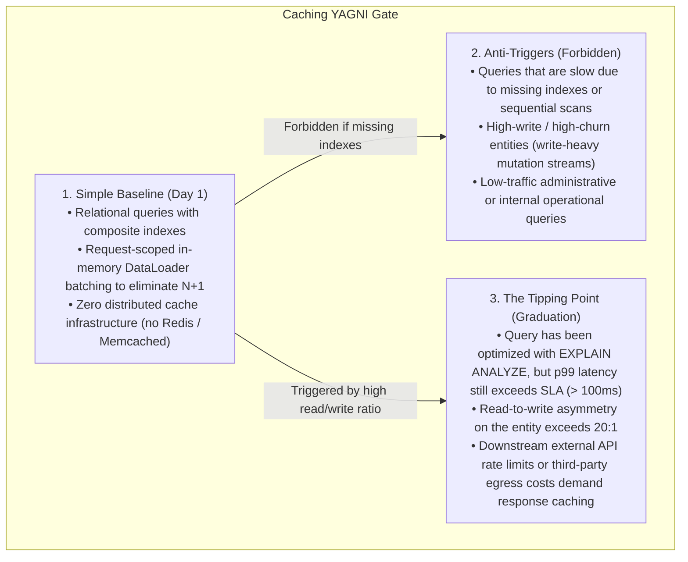
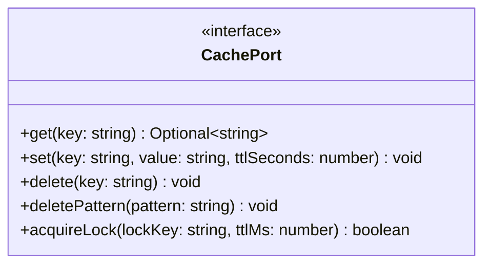

# Caching Strategies & Event-Driven Invalidation

> **Core Mandate:** Enforce Cache Port semantics with namespaced keys, jittered TTLs, XFetch stampede defense, event-driven cache invalidation, and HTTP conditional caching (ETags / 304).

---

## 1. The YAGNI Gate: Database First, Caching Second

Caching introduces state duplication, cache invalidation race conditions, and memory overhead. **Caching is never a substitute for missing database indexes or poorly structured SQL queries.**



---

## 2. Abstract Cache Port & Cache-Aside Pattern

Application services interact with caching infrastructure through a swappable **Cache Port**, supporting any backend (Redis, Valkey, Dragonfly, KeyDB, Memcached, or in-memory LRU):



### Cache-Aside Implementation & Stampede Defense
```
function getCachedOrFetch(cachePort, key, ttlSeconds, fetcher):
  cachedValue = cachePort.get(key)
  if cachedValue is present:
    return deserialize(cachedValue)

  freshValue = fetcher()
  // Add 10% random jitter to TTL to prevent simultaneous expiration spikes
  jitter = randomInt(0, floor(ttlSeconds * 0.1))
  cachePort.set(key, serialize(freshValue), ttlSeconds + jitter)
  return freshValue
```

For high-throughput cache regeneration, employ the **XFetch algorithm** (probabilistic early expiration) to asynchronously warm the cache before hard expiry.

---

## 3. Key Namespacing & Event-Driven Invalidation

- **Universal Key Hierarchy**: Structure all keys hierarchically:
  `tenant:{tenantId}:{entity}:{entityId}` (e.g. `tenant:123:order:987`)
- **Event-Driven Invalidation**: Invalidate affected cache keys immediately upon emitting domain mutation events (`OrderUpdated`, `CustomerDeleted`) rather than waiting for passive TTL expiry.

---

## 4. HTTP Conditional Caching (ETags)

- Generate strong cryptographic `ETag` hashes (e.g. SHA-256 of representation or resource version) for cacheable `GET` endpoints.
- Return **`304 Not Modified`** with zero payload body when inbound requests present matching `If-None-Match` headers, preserving bandwidth and client CPU.
