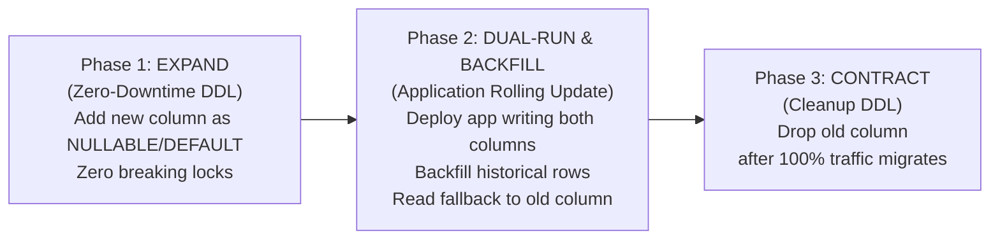

# Database Operations, Migrations & Performance Engineering

> **Core Mandate:** Enforce zero-downtime expand-contract migrations via declarative tools, systematic N+1 query elimination via DataLoader/batching, composite tenant indexing, connection pooling, and continuous point-in-time recovery (PITR).

---

## 1. Zero-Downtime Expand-Contract Migrations

Database schema migrations must never require maintenance windows or downtime. Follow the **3-Phase Expand-Contract Pattern**:



### Invariants:
1. **Never Rename Columns in a Single Step**: Renaming a column causes running application instances to crash. Always expand with a new column, dual-write, backfill, and drop the old column in a subsequent release.
2. **Concurrent Index Creation**: In PostgreSQL, never create indexes with standard blocking DDL. Always use `CREATE INDEX CONCURRENTLY` to prevent locking table writes.
3. **Declarative Migration Tooling**: Standardize on open-source declarative migration tools (e.g. **Atlas**, **Flyway**, or **Liquibase**) that compute deterministic migration plans against production schemas.

---

## 2. Performance Engineering & N+1 Query Defense

A catastrophic database performance bottleneck is the **N+1 Query Problem**, where an application executes 1 query for a list and $N$ additional queries for related records in a loop.

### Invariants:
1. **Mandatory DataLoader / Batch Fetching**: In GraphQL resolvers, ORM mappers, or loop iterations, always batch entity queries via a DataLoader or SQL `IN (...)` batch queries:
   ```typescript
   // Correct: Single batched query for all tenant users
   const users = await userLoader.loadMany(userIds);
   ```
2. **Composite Tenant Indexes**: In multi-tenant systems, every primary lookup index must include `tenant_id` as the leading column:
   ```sql
   -- Correct: Optimized for tenant-scoped date range filtering
   CREATE INDEX idx_orders_tenant_created 
     ON orders (tenant_id, created_at DESC);
   ```
3. **Index Hygiene & Covering Indexes**: Use `EXPLAIN (ANALYZE, BUFFERS)` to verify index scans. For high-frequency queries, use covering indexes (`INCLUDE (...)`) to satisfy queries directly from index pages without heap fetches.

---

## 3. Connection Pooling & Resource Limits

Database connections are expensive resources requiring thread stacks and memory allocation. An uncapped connection pool will exhaust database memory and crash the server under load spikes.

### Invariants:
1. **Dedicated Connection Pooling**: In production, deploy a dedicated connection pooler (e.g. **PgBouncer** in transaction pooling mode for PostgreSQL, or **HikariCP** in JVM runtimes).
2. **Connection Sizing Formula**: Size application pools conservatively using the standard Postgres sizing formula:
   $$\text{connections} = ((\text{core\_count} \times 2) + \text{effective\_disk\_count})$$
   Over-allocating connections (e.g., 500 connections on an 8-core server) causes severe CPU thrashing and context-switch latency.
3. **Connection Lifecycle Limits**: Configure `max_lifetime` (e.g. 30 minutes) and `idle_timeout` (e.g. 10 minutes) to cycle stale connections and prevent socket leaks.

---

## 4. Operational Resilience & Backup Baselines

1. **Continuous Point-In-Time Recovery (PITR)**: Production databases must configure continuous WAL (Write-Ahead Log) archiving to object storage (e.g. via `pgBackRest` or `wal-g`), enabling recovery to any arbitrary second within the retention window.
2. **Autovacuum Tuning (PostgreSQL)**: For high-throughput transactional tables, tune autovacuum parameters to prevent table bloat and transaction ID wraparound:
   ```sql
   ALTER TABLE orders SET (
     autovacuum_vacuum_scale_factor = 0.05,
     autovacuum_vacuum_cost_limit = 1000
   );
   ```
3. **Database Role Separation**: The application connection user must never connect as `postgres` or `superuser`. Create a dedicated least-privilege `app_user` granted only `DML` (`SELECT`, `INSERT`, `UPDATE`, `DELETE`) on application tables.
