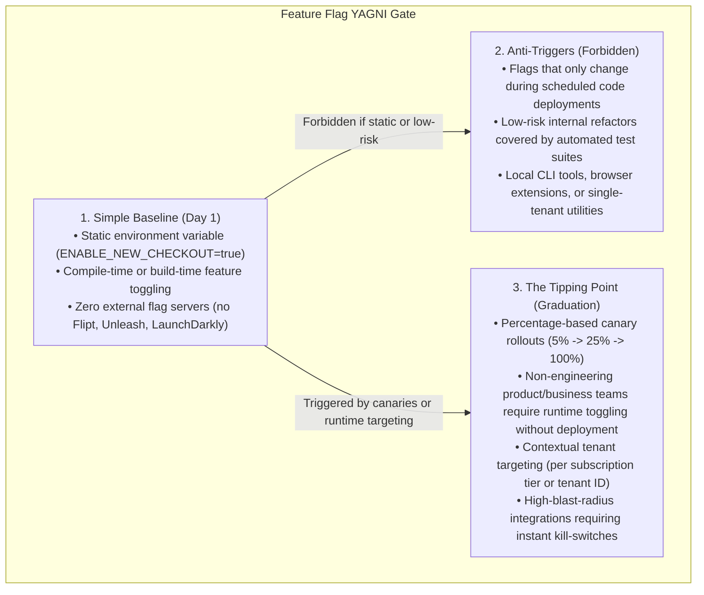

# Feature Flagging & OpenFeature Standards

> **Core Mandate:** Enforce the open-source OpenFeature standard, evaluate flags dynamically via Flipt or Unleash backends, and maintain clean flag lifecycles.

---

## 1. The YAGNI Gate: Environment Variables vs. Dynamic Feature Flags

Dynamic feature flag platforms (Flipt, Unleash) introduce network I/O, external infrastructure dependencies, and branching code complexity. **Never deploy a feature flag server when an environment variable or static config satisfies the requirement.**



---

## 2. OpenFeature Standard Architecture

When the tipping point is reached, utilize open-source `@openfeature/server-sdk` with open-source providers (Flipt or Unleash):

```typescript
import { OpenFeature, Client } from '@openfeature/server-sdk';
import { FliptProvider } from '@openfeature/flipt-provider';

OpenFeature.setProvider(new FliptProvider({ url: process.env.FLIPT_URL }));
export const featureClient: Client = OpenFeature.getClient();
```

---

## 3. Contextual Tenant Targeting

Pass tenant identity and contextual attributes during evaluation:

```typescript
const isEnabled = await featureClient.getBooleanValue(
  'advanced-analytics',
  false,
  {
    targetingKey: user.id,
    tenantId: user.tenantId,
    tier: tenant.subscriptionTier
  }
);
```

---

## 4. Flag Lifecycle Governance

- **Emergency Kill Switches**: Every high-risk feature or third-party integration must be wrapped in a flag that can immediately disable functionality without code redeployment.
- **Retirement Mandate**: When a feature is 100% rolled out for > 30 days, author a task to purge the flag and its dead code branches.
