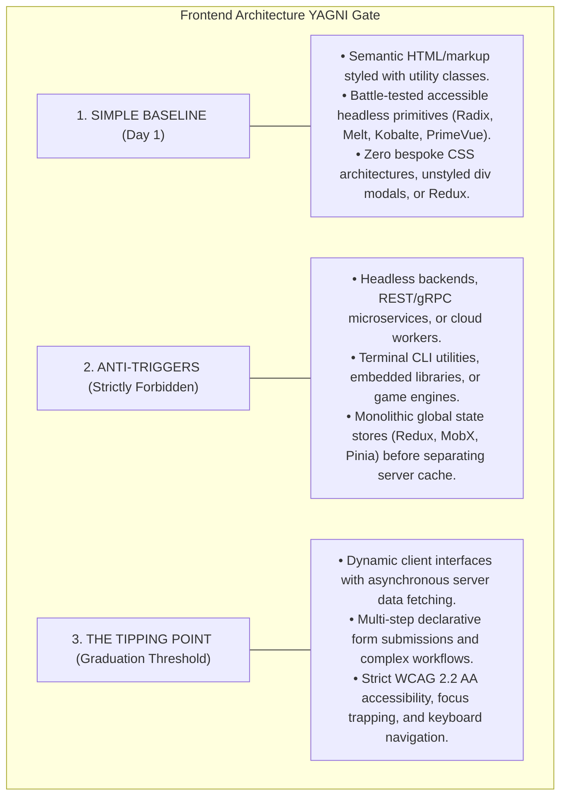
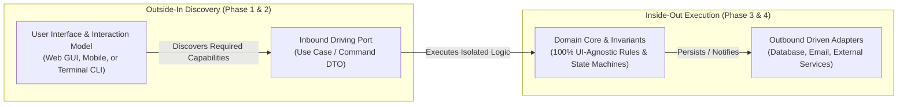

# Frontend Architecture & Client State Management

> **Core Mandate:** Enforce production-grade client architecture: accessible headless component primitives, WCAG 2.2 Level AA compliance, asynchronous server-state cache synchronization and deduplication, declarative contract schema form validation, bidirectional URL navigation synchronization, explicit 5-tier state separation, and symmetrical design tokens.

---

## 1. The YAGNI Gate: Semantic Markup & Headless Primitives vs. Premature Sprawl

Frontend engineering is frequently derailed by two opposing anti-patterns: **reinventing the wheel** (hand-rolling custom dialogs and bespoke CSS architectures) or **premature framework sprawl** (installing heavy global state machines for simple data flows).



---

## 2. The Asymmetry Law: Outside-In Discovery vs. Inside-Out Execution

A fundamental architectural question is: **Does the User Interface dictate Business Logic, or does Business Logic dictate the UI?**

The answer is governed by the **Outside-In Discovery vs. Inside-Out Execution Asymmetry**:



### 1. Outside-In Discovery (Why Interaction Must Be Refined Early)
- The user's operational mental model, workflow steps, and interaction touchpoints (whether Web forms, CLI flags, or API endpoints) **guide the discovery of system capabilities**.
- If business logic is authored in a vacuum without interaction analysis, engineers build speculative methods and database models that do not align with user journeys (**The Anemic Core Antipattern**).
- *Mandate:* In Phase 1 (Requirements) and Phase 2 (Domain Analysis), interaction models and wireframe workflows must be refined early via [`product-analyst`](../../.agents/skills/product-analyst/SKILL.md) and [`ui_ux_architecture.md`](./ui_ux_architecture.md).

### 2. Inside-Out Execution (Why Domain Logic Remains Pure)
- Once discovered, **business invariants are 100% decoupled from the UI**.
- A business rule (e.g. *"An invoice cannot be paid twice"*, *"Discount cannot exceed 50%"*) must never live in a React `onClick` handler, a component hook, or a CLI flag parser (**The Smart UI Antipattern**).
- The presentation layer merely parses user interaction into a plain **Command DTO** and calls an **Application Use Case** (Driving Port).
- If the Web UI is replaced with a CLI or a background job, the core domain logic requires **zero modifications**.

### 3. What If a Project Has No UI? (Headless Topologies)
- For Headless Backends, Daemon Workers, and Embedded Systems:
  - The **API Schema (OpenAPI / gRPC Protobuf) or Function Signature IS the UI**.
  - For a CLI Utility, the **Command Pipeline (flags, stdin/stdout, exit codes)** IS the UI.
  - The principle remains identical: the external interface defines the boundary contract, while the internal engine enforces pure invariants.

---

## 3. Component Primitives, Headless Accessibility & WCAG 2.2 Standards

- **Accessible Headless Primitives**: All interactive UI components (dialogs, dropdowns, selects, tabs, tooltips, popovers) must decouple behavioral accessibility (focus trapping, keyboard navigation, ARIA states) from visual presentation using headless primitives:
  - *React:* `@radix-ui` / `shadcn/ui` in `@/components/ui/`
  - *Vue:* `radix-vue` / `shadcn-vue` or `primevue`
  - *Svelte:* `melt-ui` / `bits-ui`
  - *Solid:* `@kobalte/core`
  - *Angular:* `@angular/cdk/a11y`
- **Zero Unstyled Raw Elements**: Never create unstyled raw HTML modals, dropdowns, or custom select tags using raw `<div>` tags and ad-hoc mouse-only click handlers.
- **Focus Management & Trapping**:
  - Modal dialogs must trap keyboard focus within the dialog container while open.
  - Closing a dialog must return keyboard focus deterministically to the triggering element.
- **Visible Focus Indicators**: Never remove default outline rings (`outline: none`) without providing an explicit, high-contrast replacement (`focus-visible:ring-2 focus-visible:ring-offset-2`).
- **Dynamic Content & ARIA Live Regions**:
  - Asynchronous notifications, toast alerts, and status updates must use `role="status"` or `aria-live="polite"` so screen readers announce changes without interrupting the user.
  - Critical error alerts must use `role="alert"` or `aria-live="assertive"`.
- **Strict Prohibition of Native Dialogs**: Browser-native `window.alert()` and `window.confirm()` are strictly forbidden. Use accessible headless dialogs (`<ConfirmDialog />`).
- **Utility Styling & Class Merging (`cn` helper)**: Combine utility classes using deterministic class merging (e.g., `clsx` and `tailwind-merge` via `cn(...)`) to allow clean prop overrides and consistent theming.

---

## 4. Server-State Cache Synchronization & Invalidation

- **Decoupling Remote Cache from Local State**: Server state (owned remotely, asynchronous, shared across clients) must never be treated as local synchronous client state.
- **Mandatory Cache Synchronization Engine**: Asynchronous data fetching, caching, deduplication, and background revalidation must use a dedicated cache synchronization manager (e.g., TanStack Query, SWR, or RTK Query in React; Pinia Colada or VueUse `useFetch` in Vue; Superforms or SvelteKit load functions in Svelte; Angular Signals with HttpClient).
- **Elimination of Raw Lifecycle Fetch Loops**:
  - *Anti-Pattern:* Uncoordinated manual fetching in component lifecycles (`useEffect(() => { fetch().then(...) })`, `onMounted`, `ngOnInit`) with hand-rolled `isLoading` and `error` boolean states.
  - *Standard Pattern (Query Hook / Cache Invalidation):*
    ```tsx
    const { data: resources, isLoading, error } = useQuery({
      queryKey: ['resources', tenantId],
      queryFn: () => api.getResources(tenantId),
    });
    ```
- **Declarative Mutations & Cache Invalidation**:
  - Mutations must declare side-effects that explicitly invalidate affected cache keys rather than imperatively splicing local component state arrays:
    ```tsx
    const queryClient = useQueryClient();
    const createResourceMutation = useMutation({
      mutationFn: (newResource: CreateResourceInput) => api.createResource(newResource),
      onSuccess: () => {
        queryClient.invalidateQueries({ queryKey: ['resources'] });
      },
    });
    ```
- **Hierarchical Query Keys**: Format query keys hierarchically as structured tuples: `['entity', id, ...filters]`, e.g., `['orders', orderId]`, `['users', tenantId]`.

---

## 5. Form State Management & Fail-Fast Schema Validation

- **Mandatory Schema Validation**: Every form submission must be validated against a formal declarative schema (Zod, Valibot, standard-schema, or framework validator) that mirrors shared DTO/input contracts.
- **Dedicated Form State Engines**: Use dedicated form engines (React Hook Form, TanStack Form, VeeValidate, Superforms, Angular Reactive Forms) that track field dirty states, touched states, and asynchronous validation without triggering full component tree re-renders.
- **Zero Unvalidated Multi-Field Objects**:
  - *Anti-Pattern:* Unvalidated ad-hoc dictionary state (`useState({ name: '', email: '' })`) with manual string checking in submit handlers.
  - *Standard Pattern:*
    ```tsx
    const form = useForm<CreateUserInput>({
      resolver: zodResolver(createUserSchema),
      defaultValues: { name: '', email: '' },
    });
    ```
- **Accessible Error Linking**: Form inputs must bind validation errors to `aria-invalid="true"` and `aria-describedby="<field>-error"`. Every input must have an associated semantic `<label>`.

---

## 6. The 5-Tier State Hierarchy & Bidirectional URL Navigation

Never dump all application state into a single global state container. Enforce strict categorical separation across 5 distinct lifecycles:

1. **Server State (Remote Cache)**: Managed exclusively by the query cache engine; invalidated by resource keys.
2. **URL State (Navigation / Search / Pagination / Filters)**:
   - Must synchronize bidirectionally with URL search parameters (`useSearchParams`) to ensure deep linkability, bookmarkability, and seamless browser history (back/forward) navigation.
   - Standard format: `?tab=security&page=2&limit=25&sort=createdAt&order=desc&status=ACTIVE`.
   - Modals and drawers representing actionable entities must synchronize with the URL (e.g. `?modal=edit-user&userId=123`).
3. **Form State (Transient Edits)**: Managed by form validation engines; discarded after submission or reset.
4. **Local Component State (Ephemeral UI)**: Managed by primitive local component state (`useState`, `ref`, `$state`) strictly for local UI toggles (dropdown open, accordion expanded, hover).
5. **Global Application State (Session / Context)**: Managed by lightweight client stores (Zustand, Pinia, Context, Signals) strictly for cross-cutting session data (current user, tenant context, active feature flags).
6. **Data Grids & Large Tables**: When building sortable, paginated, or virtualized tables, standardize on headless table engines (TanStack Table, AG Grid) with row virtualization for datasets exceeding 100 rows.

---

## 7. Theme Architecture & Symmetrical Design Tokens

- **Symmetric Design Tokens**: Ensure foundational CSS variables (`--background`, `--foreground`, `--card`, `--border`, `--popover`) are symmetrically declared across `:root` and `.dark`. Omitted root tokens in `.dark` result in unstyled backgrounds and illegible text when switching themes.
- **System Preference Detection & Reactive Synchronization**: `ThemeProvider` implementations must listen to `window.matchMedia('(prefers-color-scheme: dark)')` with dynamic event listeners so OS appearance toggles seamlessly propagate in real-time, and synchronize `document.documentElement.style.colorScheme = resolvedTheme` to ensure browser-native elements (scrollbars, input widgets) match the active theme.
