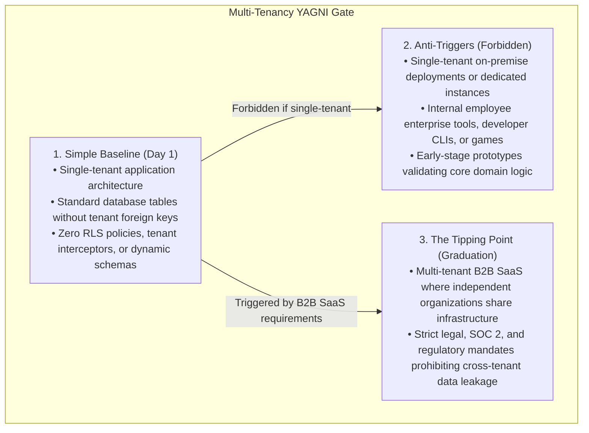
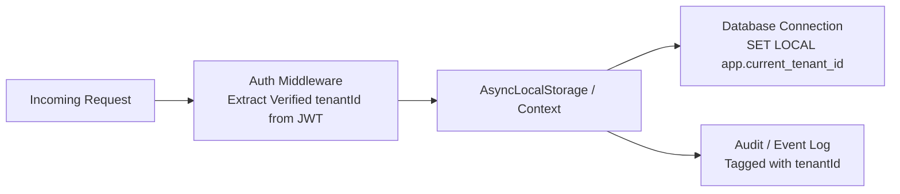

# Multi-Tenancy Architecture, Isolation & Extensibility

> **Core Mandate:** Enforce tenant context resolution from trusted cryptographic tokens, strict data isolation across the 4 tenancy models, leak-proof PostgreSQL Row-Level Security (RLS), and YAGNI-gated tenant extensibility (dynamic JSON schemas and sandboxed pluggable logic).

---

## 1. The Multi-Tenancy YAGNI Gate: Single-Tenant vs. Shared SaaS

Multi-tenancy introduces significant operational complexity: tenant routing, cross-tenant data leak risks, noisy neighbor resource starvation, and complex database migrations. **Never force multi-tenant abstractions onto applications that execute in single-tenant boundaries.**



---

## 2. Tenant Context Resolution

Tenant identity must be resolved at the edge/gateway from **cryptographically verified session context**, never from spoofable client input:



### Invariants:
1. **Never Trust Raw Query/Body Parameters**: Never accept `?tenantId=...` or `{ tenantId: "..." }` on public mutations without validating that the authenticated session owns that tenant.
2. **Ambient Context Propagation**: Bind the resolved `tenantId` to an ambient request context (e.g. `AsyncLocalStorage` in Node, `ThreadLocal` in Java, `context.Context` in Go) to prevent passing tenant IDs manually through every service layer.

---

## 3. The 4 Universal Data Isolation Models

Choose the isolation model matching your security classification and cost profile:

| Model | Isolation Mechanism | Operational Trade-off | Compliance Target |
|---|---|---|---|
| **1. Pooled with RLS** | Shared DB, shared schema; tables partitioned by `tenant_id` + Postgres RLS. | Lowest infrastructure cost, highest engineering rigor required. | Standard B2B SaaS, SOC 2 Type II. |
| **2. Silo Schema** | Shared DB, separate database schema per tenant (`tenant_acme.*`). | High isolation; complex schema migrations across hundreds of schemas. | Regulated SaaS, HIPAA, FinTech. |
| **3. Silo Database** | Separate physical or logical database instance per tenant. | Highest cost and isolation; zero cross-tenant blast radius. | Enterprise Dedicated, PCI-DSS Level 1. |
| **4. App-Level Interceptor** | Shared DB, ORM/query builder automatically appends `WHERE tenant_id = :id`. | Brittle; human error in ad-hoc raw SQL queries bypasses isolation. | Forbidden for high-security applications. |

---

## 4. PostgreSQL Row-Level Security (RLS) Invariants

When using **Model 1 (Pooled with RLS)**, enforce data isolation at the database engine level so that even a buggy or malicious application query cannot access another tenant's rows:

### 1. Dual-Lock Table Setup
Every table containing tenant-scoped data must enable and force RLS:
```sql
ALTER TABLE orders ENABLE ROW LEVEL SECURITY;
ALTER TABLE orders FORCE ROW LEVEL SECURITY;
```
*(The `FORCE` clause ensures that table owners and superusers are also bound by the policy).*

### 2. Session Context Binding
The application connection pool must initialize the tenant session variable inside every transactional checkout:
```sql
-- Executed inside transaction before running queries
SELECT set_config('app.current_tenant_id', :tenantId, true);
```

### 3. Declarative Tenant Isolation Policy
```sql
CREATE POLICY tenant_isolation_policy ON orders
  AS RESTRICTIVE
  FOR ALL
  TO application_user
  USING (tenant_id = NULLIF(current_setting('app.current_tenant_id', true), '')::UUID)
  WITH CHECK (tenant_id = NULLIF(current_setting('app.current_tenant_id', true), '')::UUID);
```

---

## 5. Advanced Tenant Extensibility (YAGNI Gated)

### 5.1. Dynamic Schemas (Runtime Custom Fields)
- **Tipping Point:** External enterprise tenants require self-service custom fields without engineering running relational DDL migrations.
- **Hybrid Storage Pattern:** Core relational columns for shared invariants + `custom_attributes JSONB` validated against **JSON Schema Draft 2020-12** stored per tenant.
- **Fail-Fast Schema Validation:** Custom field inputs must be validated against the tenant's compiled JSON schema before database persistence.

### 5.2. Pluggable Tenant Logic (Sandboxed Scripting)
- **Tipping Point:** Enterprise tenants require custom business logic (tax calculation, approval routing) executed at runtime.
- **Zero Raw `eval()`**: Never execute tenant code via raw `eval()`, Python `exec()`, or NodeJS VM isolates.
- **Safe Sandboxing**:
  - *Simple Expressions:* Use **Common Expression Language (CEL)** (Google) for safe, deterministic boolean and mathematical evaluation.
  - *Complex Logic:* Compile tenant extension plugins to **WebAssembly (Wasm)** executed via Wasmer or Wasmtime with strict CPU time and memory quotas.
