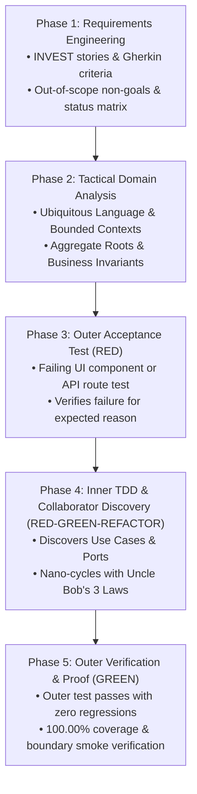
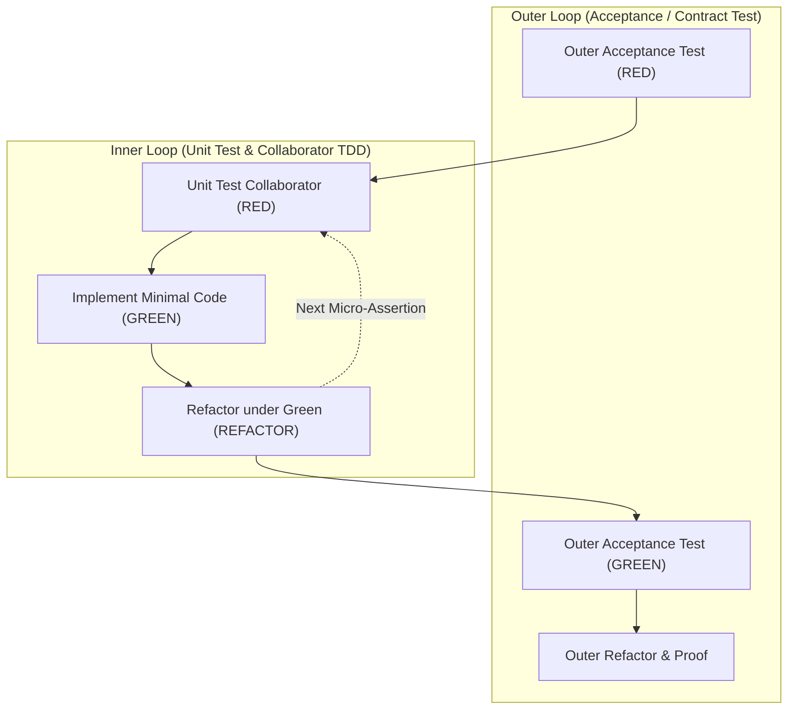
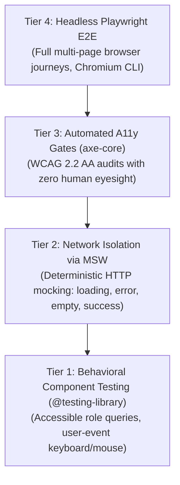

# Test-Driven Development (London School TDD) & Test Isolation Standards

> **Core Mandate:** Drive all features through the non-negotiable 5-Phase Agile Domain Lifecycle (Outside-In Double-Loop TDD, Uncle Bob's 3 Laws), enforcing transactional database rollback per test, zero-sleep determinism, and non-negotiable 100.00% statement, branch, and function coverage gates.

---

## 1. The Immutable 5-Phase Agile Domain Lifecycle

Every functional increment, feature, or architectural modification must traverse this unbroken sequence. Writing code out of order (e.g. coding before tests, or testing before domain analysis) is strictly prohibited.



---

## 2. The London School Double-Loop TDD Workflow

Drive all user-facing features from the outermost interface inward:



1. **Outer Acceptance / Contract Test First**: Every feature begins with a failing outer acceptance test:
   - **Frontend (UI)**: Component or page tests asserting user interactions, form submissions, accessibility, and visual states.
   - **Backend (API)**: Black-box REST route tests asserting HTTP verbs, request schemas, RFC 7807 problem details, and status codes.
2. **Collaborator Discovery**: Outer tests do not implement business logic directly; they discover and shape the contracts of their immediate collaborators (Use Cases, Domain Services, Repositories).
3. **Inner Unit Tests with Test Doubles**: Unit test collaborators in isolation using test doubles and mocks (`Controllers/Handlers` ➔ `Use Cases` ➔ `Ports/Adapters`).
4. **Mock Ownership Principle**: **Only mock types you own**. Always wrap third-party libraries, database drivers, and external network clients in application-owned port adapters before mocking.
5. **Atomic Double Loop**: Follow the strict rhythm: **RED (Fail) ➔ GREEN (Pass) ➔ REFACTOR (Clean/De-duplicate)**. Never skip the Refactor phase.
6. **Cross-Package Boundary Verification**: In monorepos with frontend dev servers or API gateways (Vite, NGINX), outer-loop verification must explicitly test reverse-proxy forwarding and real network serialization (`scripts/smoke_test.sh`), ensuring client-side SPA fallbacks do not mask unmapped backend routes.

---

## 3. The Zero-Deviation Invariant (Why We NEVER Deviate)

Deviating from this lifecycle introduces catastrophic defects and architectural rot:

| Deviation Shortcut | Immediate Consequence | Systemic Impact |
|---|---|---|
| **Skipping Domain Analysis** | Hallucinated entities, missing business invariants, wrong data models. | "The Toy Prototype Blunder": Foreign key string inputs, unvalidated states, costly migrations. |
| **Writing Code Before Tests** | Untested edge cases, unfalsifiable code, confirmation bias in test design. | Hidden bugs in production, regressions during refactoring, brittle codebases. |
| **Skipping Outer Acceptance Tests** | In-memory unit tests pass, but user interactions and network routing fail. | "The In-Memory Supertest Illusion": App says "Offline/Connecting" while 100% unit tests pass. |
| **Dropping the UI in Fullstack TDD** | Developer plunges into internal domain units, leaving the application headless with no web UI. | "The Headless Fallacy": User requests a fullstack web app but receives pure headless backend libraries. |
| **Skipping the Refactor Phase** | Technical debt accumulates immediately behind green tests. | Code rot, duplicated logic, bloated monolithic functions (> 30 lines), violated DRY/SLAP. |

---

## 4. The Batch-Test Anti-Pattern & The Incremental Nano-Cycle

### The "Test-First Waterfall" Anti-Pattern (BANNED)
A rampant anti-pattern in AI coding is dumping 10–20 test cases in a single test file, and then writing a 300-line implementation file in one shot so all tests pass simultaneously. **This is strictly prohibited.**
- **Why It Fails:** Writing all tests upfront is Waterfall in disguise. It forces the AI to hallucinate and lock in speculative method signatures and class structures before any code runs. If test #3 reveals a design flaw, tests #4–20 are broken legacy code before running.
- **Falsifiability Failure:** When 20 tests fail at once, you never prove that each individual assertion would catch its specific regression. Many batch tests are tautologies that pass by coincidence.

### The Mandatory Incremental Nano-Cycle
Every collaborator discovered in Phase 4 must progress through micro-cycles of one behavior at a time:
1. **RED (Micro-Assertion):** Write **ONE** test asserting a single micro-behavior (e.g. `expect(cart.total()).toBe(0)`).
2. **VERIFY RED:** Run the test suite (`npm test`). **Inspect and verify the specific failure message** (e.g. "method not defined" or "expected 0, got undefined"). Never skip running the test while RED.
3. **GREEN (Minimal Implementation):** Write the **absolute minimum production code** required to pass the single failing assertion (even hardcoding `return 0` if appropriate).
4. **VERIFY GREEN:** Run the test suite. Confirm the test turns green with zero side effects.
5. **REFACTOR (Under Green):** Clean up names, eliminate duplication (DRY), enforce SLAP and Clean Code standards while tests remain 100% green.
6. **REPEAT:** Move to the next micro-behavior (e.g. `cart with 1 item returns item price`).

---

## 5. Ping-Pong Pair Programming Protocol with AI

When pairing with the human developer, operate in true **Ping-Pong TDD**:

```mermaid
sequenceDiagram
    autonumber
    actor A as Partner A (Driver/Human)
    participant S as Test Runner
    actor B as Partner B (Navigator/AI)
    
    A->>S: Writes 1 micro-test assertion (RED)
    S-->>A: Displays verified failure output
    B->>S: Writes minimal code to pass (GREEN)
    S-->>B: Displays verified pass
    Note over A,B: Both refactor under green (REFACTOR)
    Note over A,B: Roles swap; repeat for next behavior
```

- **Collaborative Steering**: The human developer can write the test while the AI writes the minimal pass, or the AI can present each micro-test and await confirmation before implementing.
- **Continuous Alignment**: Design and data structures emerge organically through mutual feedback rather than monolithic code dumps.

---

## 6. Test Isolation & Determinism

- **Transactional Rollback per Integration Test**:
  - Every integration test that interacts with persistence must execute within a scoped transaction that is rolled back upon test completion (`afterEach` rollback) or use ephemeral, disposable database isolates. Never leave mutated rows that pollute subsequent tests.
- **Deterministic Test Data Factories**:
  - Utilize strongly-typed test data factories (`buildUser()`, `buildOrder()`) with randomized unique identifiers rather than hardcoded magic strings or fixed database IDs.
- **Zero Sleep / Flakiness Elimination**:
  - Strictly forbid arbitrary `sleep()` or timeout pauses in tests.
  - Rely exclusively on deterministic condition polling (`waitFor(condition)`) or reactive event promises to eliminate test flakiness.

---

## 7. Mandatory 100.00% Test Coverage Thresholds

- **Strict Coverage Thresholds**: Maintain line, function, branch, and statement test coverage at **100.00%** across all backend domain logic, adapters, contracts, and frontend suites. Strictly enforce 100% threshold failure gates in CI pipelines (`scripts/test_coverage.js`).
- **Exhaustive Status Codes & Error Branches**: Explicitly test all HTTP/gRPC response codes:
  - Success: `200 OK`, `201 Created`, `204 No Content`
  - Client Errors: `400 Bad Request`, `401 Unauthorized`, `403 Forbidden`, `404 Not Found`, `409 Conflict`, `422 Unprocessable Entity`, `429 Too Many Requests`
  - Server Failures: `500 Internal Server Error`, `503 Service Unavailable`
- **UI Interaction States & Edge Cases**: Fully assert all presentation states (loading spinners, disabled controls, error banners, success feedback, empty states) across suites.

---

## 8. Headless UI Testing Architecture for Autonomous Agents

Autonomous AI coding agents operate without human eyesight. To verify user interfaces deterministically without manual browser clicking, projects with UI interfaces must enforce the **4-Tier Headless UI Testing Pyramid**:



### 8.1. Behavioral Component Testing (@testing-library + jsdom/happy-dom)
- **Test Behavior, Not Implementation**: Never assert component internal state, hook variables, or private methods. Assert what the user experiences.
- **Strict Accessible Role-Based Queries**:
  - *Mandatory:* `screen.getByRole('button', { name: /submit/i })`, `screen.getByRole('heading', { level: 1 })`, `screen.getByLabelText(/email/i)`.
  - *Prohibited:* `container.querySelector('.btn-primary')`, `getByTestId('submit-btn')` (data-testid is a banned crutch for poor semantic accessibility).
- **Realistic User Events**: Always use `@testing-library/user-event` rather than synthetic `fireEvent` to accurately simulate browser focus, keypress, typing, and click sequences.

### 8.2. Network Isolation via Mock Service Worker (MSW)
- Never mock client fetch/HTTP clients with ad-hoc mock objects (`vi.fn()`).
- Intercept requests at the network layer using **MSW**:
  ```typescript
  // Deterministic network boundary simulation
  http.get('/api/v1/orders', () => HttpResponse.json(mockOrders))
  ```
- **The 4 Universal UI Presentation States**: Component tests must explicitly assert:
  1. *Loading State:* Accessible spinner / skeleton is rendered while request is in flight.
  2. *Success State:* Data grid / list renders items with correct semantic markup.
  3. *Error State:* RFC 7807 error banner renders with retry button when API returns `500` or `422`.
  4. *Empty State:* Meaningful empty-state message and CTA when API returns `[]`.

### 8.3. Automated Headless Accessibility Gates (axe-core)
- Every component test suite must execute automated accessibility checks using `axe-core` (`vitest-axe` or `@axe-core/playwright`):
  ```typescript
  const { container } = render(<OrderDetailsModal orderId="ord_123" />);
  const results = await axe(container);
  expect(results).toHaveNoViolations();
  ```
- Fails the test automatically on missing ARIA labels, invalid heading hierarchies, contrast defects, or unlinked form labels without requiring human eyesight.

### 8.4. End-to-End Headless Browser Automation (Playwright)
- For critical user journeys (authentication, checkout, resource creation):
  - Run headless Chromium in CLI/CI: `npx playwright test`.
  - Configure automated forensic captures on failure: screenshots, trace files, and videos saved to `test-results/` for immediate agent inspection.
