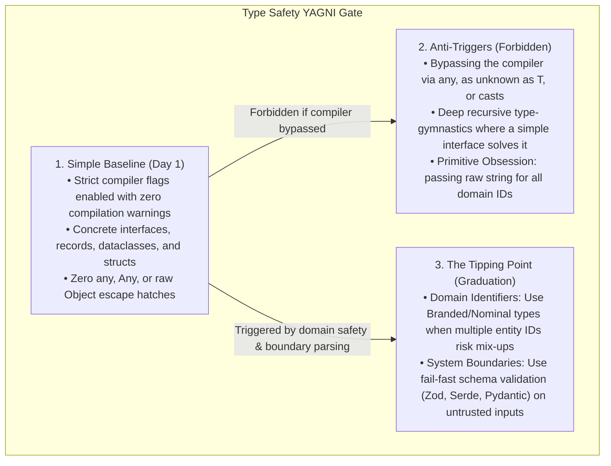
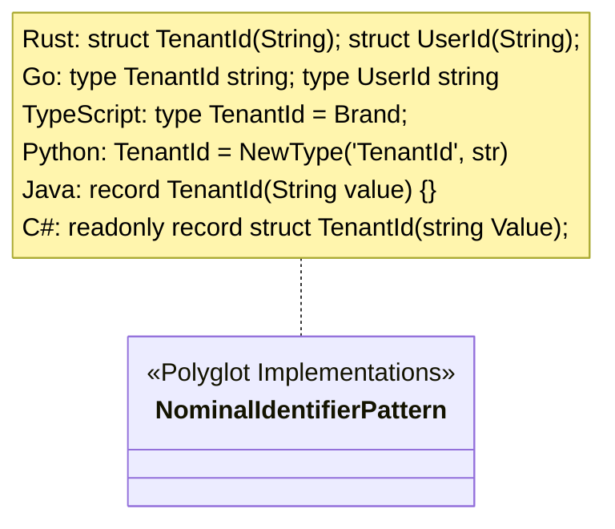

# Static Type Safety & Sound Type Systems

> **Core Mandate:** Enforce maximum compiler strictness, branded nominal typing for domain identifiers, strict prohibition of untyped escape hatches, and automated pre-commit quality guardrails across polyglot implementations.

---

## 1. The YAGNI Gate: Sound Types vs. Type-Level Acrobatics

Type systems exist to prove program correctness and eliminate entire classes of runtime errors. **Never compromise static type safety with `any` escape hatches, but avoid premature type-level metaprogramming acrobatics that obscure domain intent.**

---

## 2. Maximum Compiler Strictness Across Polyglot Stacks

Regardless of the execution language chosen for an adapter, service, or CLI, enforce maximum compiler rigor to eliminate runtime null pointer exceptions, unhandled type cases, and memory errors at compile time:

- **TypeScript**: Enable all strict compiler flags (`strict: true`, `noImplicitAny: true`, `strictNullChecks: true`, `noUncheckedIndexedAccess: true`).
- **Python**: Enforce strict type checking (`mypy --strict` or `pyright` in strict mode).
- **Rust**: Enable `#![deny(clippy::all)]` and `#![deny(missing_docs)]` with zero `unsafe` blocks.
- **Go**: Enable comprehensive static analysis (`golangci-lint` with `errcheck`, `govet`, `staticcheck`).
- **Java**: Enable `-Werror -Xlint:all`, enforce `@NonNull` contracts or the Checker Framework.
- **C#**: Enable `<Nullable>enable</Nullable>` and `<TreatWarningsAsErrors>true</TreatWarningsAsErrors>`.

---

## 3. Branded Nominal Typing & Primitive Obsession Elimination

Prevent accidental mixing of raw primitive identifiers (e.g. passing an arbitrary `string` representing a `TenantId` where a `UserId` is expected) by enforcing nominal types across all supported languages:

Domain functions must accept and return branded types rather than raw primitive strings or integers.

---

## 4. Strict Prohibition of Untyped Escape Hatches

- **Zero Tolerance for Unsound Types**: Strictly prohibit `any` in TypeScript, raw `interface{}` / `any` without type assertion checks in Go, raw `Any` in Python, or unchecked casts in Java/Rust/C#.
- **Runtime Validation at Boundaries**: External payloads (network requests, message queues, disk files) must be parsed and narrowed into strongly-typed domain structures before passing to application services (e.g. via Zod in TS, Pydantic in Python, Serde in Rust, Jackson/Record validation in Java).
- **Commit Guardrails**: Enforce Conventional Commits via commit linters. Never bypass pre-commit hooks running static type checking, formatting, and linters.

---

## 5. Clean Import Hygiene & Relative Traversal Elimination

- **Path Alias Mandate**: In languages supporting path aliases (TypeScript, Python packages, Go modules), configure root module resolution (e.g. `@/*` mapped to `./src/*`) to prevent brittle relative coupling.
- **Strict Prohibition of Deep Relative Traversal**: Never use deep relative traversals (`../../../..`, `../../..`, `../..`) across layers or contexts. Deep relative paths create fragile coupling, impair refactoring, and obscure domain layer boundaries.
- **Scope of Sibling Imports**: Local relative imports (`./file`) are permitted only for immediate siblings within the identical directory. Any import traversing up a directory hierarchy or crossing architectural boundaries (domain, ports, adapters, components, context) MUST resolve via root package paths or aliases.
