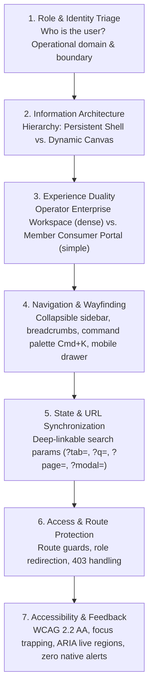
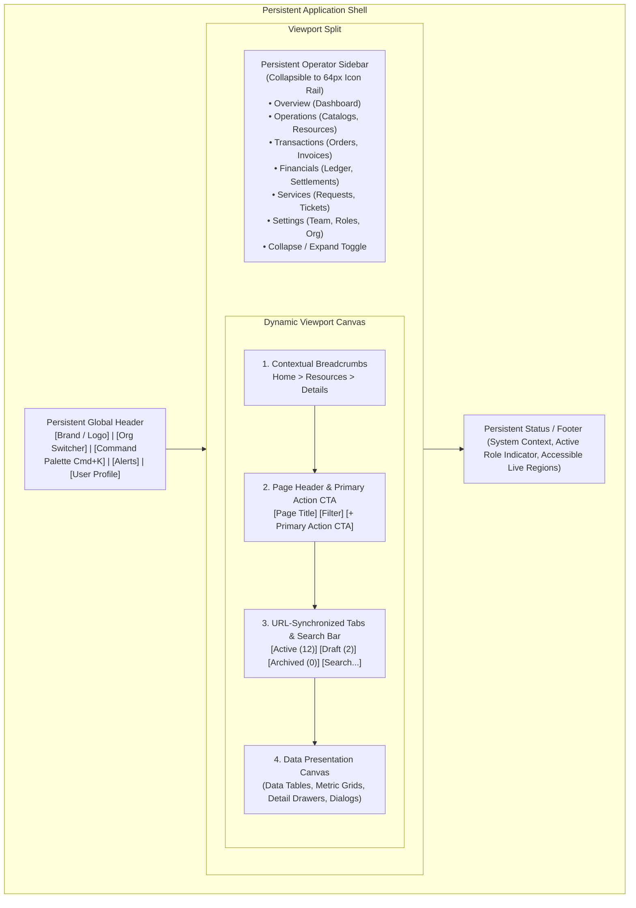

# UI/UX Architecture, Design Triage & Role-Based Navigation System

> **Core Mandate:** Enforce mandatory upfront Design Architecture Triage before writing UI code, a strict dual-experience model separating Enterprise Operator Workspaces from Consumer / Member Self-Service Portals, a persistent application shell with collapsible sidebar navigation, bidirectional URL state synchronization, and strict decoupling of developer demo personas from production authentication.

---

## 1. The Design Architecture Triage Gate

A catastrophic software defect occurs when design architecture is not triaged upfront—resulting in ad-hoc navigation, mixed-up user roles, toy-like prototypes, and broken user journeys.

Before a single UI component or view is built, every interface increment must pass the **7-Pillar Design Architecture Triage Gate**:



---

## 2. App Shell Architecture: Persistent Shell vs. Dynamic Canvas

The application interface is strictly divided into two distinct anatomical zones:



### 2.1. The Persistent Shell (Never Re-rendered Across Page Navigations)
- **Top Header**:
  - **Brand Anchor**: Visual identity and immediate home navigation.
  - **Organization Context Switcher**: Dropdown selector allowing operators to switch multi-tenant organization contexts (`organizationId`) with automatic data re-fetching.
  - **Command Palette (`Cmd + K` / `Ctrl + K`)**: Global keyboard-first navigation and entity search.
  - **Notification Center**: Bell icon with unread count badge displaying critical alerts (approvals, overdue items, system events).
  - **User Profile & Account Menu**: User avatar, full name, role badge, account settings, and secure sign-out.
- **Collapsible Sidebar (Desktop Operator View)**:
  - Default expanded (`w-64` / 256px) with categorized section headings and labels.
  - Collapses smoothly into a slim icon-only rail (`w-16` / 64px) with hover tooltips and active indicator pills.
  - Collapse state is persisted in `localStorage` (`app_sidebar_collapsed`).
  - Mobile view collapses into a slide-over off-canvas sheet triggered by a hamburger button.
- **Accessible Feedback Layer**:
  - Floating toast container and ARIA live regions for mutation confirmations (`role="status"`) and errors (`role="alert"`).

### 2.2. The Dynamic Canvas (Contextual to Active Route & User Role)
- **Primary Action Buttons (CTAs)**: Operator sees "+ Create Resource" or "Approve Transaction"; Member sees "Submit Request" or "Make Payment".
- **Data Table Columns**: Operators see customer contact info, financial amounts, and audit fields (`createdBy`); Members see only their own personal records.
- **Metric Widgets & Dashboards**: Operators see organization cash flow, throughput, and review queues; Members see personal account status and open request progress.

---

## 3. Dual-Experience Model: Operator Workspace vs. Consumer / Member Portal

To prevent confusing operators with consumer simplicity and overwhelming consumers with enterprise complexity, applications enforce **Two Completely Distinct Experiences**:

| Architectural Dimension | Enterprise Operator Workspace | Consumer / Member Portal (`/portal`) | Public Catalog / Landing (`/catalog`) |
|---|---|---|---|
| **Target Roles** | `ADMIN`, `OPERATOR`, `MANAGER`, `AUDITOR` | `MEMBER`, `CONSUMER`, `CUSTOMER` | Unauthenticated Visitors, Prospective Users |
| **Route Prefix** | `/` (e.g. `/resources`, `/orders`, `/analytics`) | `/portal` (e.g. `/portal`, `/portal/orders`, `/portal/support`) | `/catalog`, `/onboarding` |
| **Navigation Pattern** | Collapsible left sidebar with categorized sections | Clean top navigation bar + mobile bottom navigation bar | Simple landing header with "Sign In" CTA |
| **Information Density** | High density, tabular grids, advanced multi-filters | Low-to-medium density, card-centric, touch ergonomics | Visual cards, featured items, search badges |
| **Data Scope** | Organization-wide (all entities, transactions, ledgers) | Member-scoped (strictly own entities, orders, requests) | Public records with status `AVAILABLE` / `ACTIVE` |
| **Primary Goal** | Operational throughput, oversight, compliance, auditing | Self-service autonomy, rapid actions, account visibility | Resource discovery and user onboarding |

---

## 4. Production Authentication UX vs. Developer Persona Harness

### 4.1. Strict Decoupling Mandate
- **NEVER** embed test personas ("Admin Alice", "Operator Bob", "Member Charlie") into production sign-in forms or modals. Conflating demo personas with actual authentication makes the application feel like a toy prototype and creates severe security/UX confusion.
- **Production Sign-In (`/login`)**:
  - Clean, dedicated sign-in page or clean modal.
  - Email address and password inputs with real-time Zod schema validation.
  - Accessible error alerts (`role="alert"`).
  - Clear "Remember me" option and "Forgot password?" recovery link.
  - Dedicated registration tab or `/register` route for onboarding new tenant organizations.
- **Developer / Demo Persona Test Harness**:
  - Must be **100% decoupled** from the production sign-in form.
  - Rendered strictly via a dedicated **Dev Floating Toolbar** or bottom-right drawer:
    ```tsx
    // Only rendered in development / preview mode
    if (import.meta.env.DEV) {
      return <DevPersonaToolbar />;
    }
    ```
  - Visibly labeled: `[DEV ENVIRONMENT: Switch Persona]`.
  - Switching personas clears active query caches, updates auth context, and triggers role-appropriate post-login redirection.

---

## 5. Role-Based Access Control & Route Guarding

- **Defense in Depth**:
  - Hiding a button via `<Can permission="...">` is an ergonomic convenience, **never security**.
  - All routes must be protected by declarative route guards:
    ```tsx
    <Route element={<ProtectedRoute requiredRoles={['ADMIN', 'OPERATOR']} />}>
      <Route path="/resources" element={<ResourcesPage />} />
      <Route path="/transactions" element={<TransactionsPage />} />
    </Route>
    ```
- **Automatic Post-Login Role Routing**:
  - When a user logs in:
    - Roles `ADMIN`, `OPERATOR`, `MANAGER` ➔ Redirect to `/` (Operator Executive Dashboard).
    - Role `MEMBER`, `CONSUMER` ➔ Redirect to `/portal` (Self-Service Portal Home).
    - Unauthenticated users attempting to access protected routes ➔ Redirect to `/login?returnTo=...`.
    - Authenticated users accessing routes without permission ➔ Display an accessible 403 Forbidden screen with a "Return to Home" button.

---

## 6. Bidirectional URL State Synchronization

Per [`docs/rules/frontend_architecture.md`](./frontend_architecture.md), all view state that represents navigation, active tab, filtering, sorting, pagination, or search query must synchronize bidirectionally with URL search parameters (`useSearchParams`):
1. **Tabs**: `?tab=active`, `?tab=draft`, `?tab=archived`
2. **Filters**: `?status=ACTIVE&category=cloud`
3. **Search Queries**: `?q=alpha`
4. **Pagination**: `?page=2&pageSize=25`
5. **Drawers / Modals**: `?drawer=resource-102` or `?modal=create-order`

## 7. Production UI Hygiene & Resilience Standards

- **Multi-Tab State Synchronization**: Synchronize authentication and tenant selection across browser tabs using native `window.addEventListener('storage')`.
- **Fault-Tolerant Error Boundaries**: Wrap complex widgets, charts, and page outlets in accessible `<ErrorBoundary>` components to prevent runtime render exceptions from crashing the persistent application shell.
- **Strict Decoupling of Diagnostics & Telemetry**: Never expose internal architectural diagnostics (port health, connection badges, active role indicators) in production user-facing screens; gate diagnostic widgets strictly behind `import.meta.env.DEV`.
- **Centralized UI Copy (`UI_STRINGS`)**: Centralize all user interface copy, status labels, error notifications, and action button labels into configuration constants (`UI_STRINGS`) rather than scattering hardcoded strings across templates.
