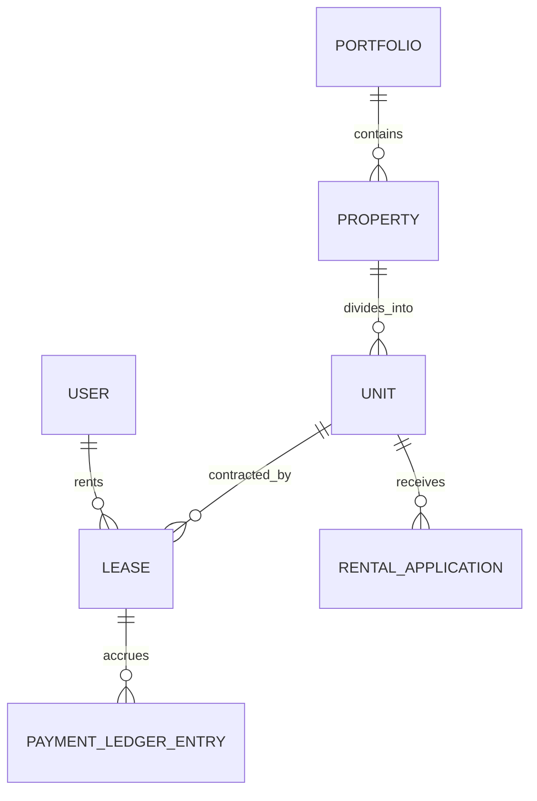

# Property Management Domain Models & Invariants

> **Core Purpose:** Architectural specification of Aggregate Roots, Entities, Value Objects, and Domain Invariants for the Property Management variant profile.

---

## 1. Domain Aggregate Roots & Entities

### 1. `Portfolio` (Aggregate Root & Multi-Tenant Boundary)
- **Role:** High-level organizational boundary for a landlord or property management company.
- **Attributes:** `id`, `name`, `ownerUserId`, Canonical 6 Total Audit Fields (`createdAt`, `createdBy`, `updatedAt`, `updatedBy`, `deletedAt`, `deletedBy`).
- **Invariants:** Every property, unit, lease, and membership must belong strictly to a single `Portfolio`.

### 2. `Property` (Entity)
- **Role:** Physical real estate structure containing units.
- **Attributes:** `id`, `portfolioId`, `name`, `address`, `city`, `state`, `zipCode`, Canonical 6 Total Audit Fields.
- **Invariants:** Cannot be deleted if it contains units with active leases.

### 3. `Unit` (Entity)
- **Role:** An individual rentable physical space within a property.
- **Attributes:** `id`, `propertyId`, `unitNumber`, `rentAmountCents`, `depositAmountCents`, `bedrooms`, `bathrooms`, `status` (`VACANT`, `OCCUPIED`, `MAINTENANCE`), Canonical 6 Total Audit Fields.
- **Invariants:** Status cannot transition to `OCCUPIED` unless an active lease exists.

### 4. `Lease` (Aggregate Root)
- **Role:** The binding contract governing occupancy and rent collection.
- **Attributes:** `id`, `portfolioId`, `unitId`, `renterUserId`, `rentAmountCents`, `depositAmountCents`, `startDate`, `endDate`, `status` (`DRAFT`, `PENDING_SIGNATURE`, `ACTIVE`, `TERMINATED`, `EXPIRED`), Canonical 6 Total Audit Fields.
- **Invariants:**
  - Cannot overlap with another active lease for the same unit.
  - `endDate` must be strictly greater than `startDate`.
  - Rent and deposit amounts must be non-negative integers (cents).
  - Only the Aggregate Root can transition status (`activate()`, `terminate()`).

### 5. `RentalApplication` (Entity / Soft FSM)
- **Role:** Prospective resident inquiry and vetting process.
- **Attributes:** `id`, `portfolioId`, `unitId`, `applicantEmail`, `applicantName`, `creditScore`, `monthlyIncomeCents`, `status` (`SUBMITTED`, `UNDER_REVIEW`, `APPROVED`, `REJECTED`), Canonical 6 Total Audit Fields.
- **Invariants:** Review stages and pipeline transitions may be configured per portfolio using CEL transition guards.

### 6. `PaymentLedgerEntry` (Immutable Ledger Record)
- **Role:** Financial audit entry recording payments, deposits, or charge assessments.
- **Attributes:** `id`, `portfolioId`, `leaseId`, `amountCents`, `type` (`RENT`, `SECURITY_DEPOSIT`, `LATE_FEE`), `status` (`PENDING`, `SETTLED`, `FAILED`), `createdAt`, `createdBy`.
- **Invariants:**
  - **Strict Immutability:** Prohibits `updatedAt`, `updatedBy`, `deletedAt`, and `deletedBy`.
  - Status transitions are append-only. Reversals require a compensating refund ledger row.

---

## 2. Value Objects
- **`Money`**: Minor currency unit (cents), currency code (`USD`), zero-division defense, arithmetic invariants.
- **`DateRange`**: Continuous temporal range ensuring `endDate >= startDate` and interval exclusion overlap checks.
- **`Privileges`**: Fine-grained `<entity>:<action>` permission strings (`property:create`, `lease:sign`, `payment:process`).
